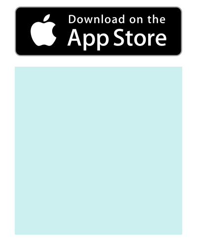
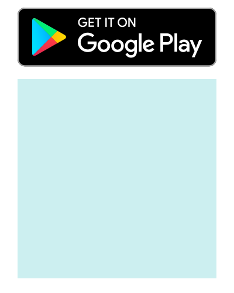

# ScanMeFindMe templates collection

Download template and use it in your PRO account on https://scanmefindme.com 

## Contributions

Create pull requests to add your templates to this collection. Please follow these guidelines:

* Suggested templates must only use [pre-installed fonts](https://github.com/ScanMeFindMe/fonts). 
* Use fill color #CCEFF0 for the &lt;rect&gt; element with id="qr" (placeholder for the QR code).
* Add a record to this file together with the pull request with a preview and download link; 
  specify author, source and license

## Templates

To download template right-click on the "download" link and select "Save link as".

<table>
    <tr>
        <td></td>
        <td>
            Author: ScanMeFindMe 
            Using image from <a href="https://commons.wikimedia.org/wiki/File:Download_on_the_App_Store_Badge.svg">wikimedia commons</a>
        </td>
        <td><a href="https://raw.githubusercontent.com/ScanMeFindMe/templates/master/templates/appstore_dark.svg">download</a></td>
    </tr>
    <tr>
        <td></td>
        <td>
            Author: ScanMeFindMe 
            Using image from <a href="https://commons.wikimedia.org/wiki/File:Google_Play_Store_badge_EN.svg">wikimedia commons</a>
        </td>
        <td><a href="https://raw.githubusercontent.com/ScanMeFindMe/templates/master/templates/googleplay_dark.svg">download</a></td>
    </tr>
</table>

