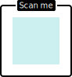

# ScanMeFindMe templates collection

Download template and use it in your PRO account on https://scanmefindme.com 

## Contributions

Create pull requests to add your templates to this collection. Please follow these guidelines:

* Suggested templates must only use [pre-installed fonts](https://github.com/ScanMeFindMe/fonts). 
* Use fill color #CCEFF0 for the &lt;rect&gt; element with id="qr" (placeholder for the QR code).
* Add a record to this file together with the pull request with a preview and download link; 
  specify author, source and modifications restrictions (if any)
* All templates uploaded here must be free for use for commercial or non-commercial purposes
  without attribution.

## Templates

To download template right-click on the "download" link and select "Save link as".

<table>
    <tr>
        <td></td>
        <td>
            Author: ScanMeFindMe 
            Template may be modified but
            it is prohibited to alter the <a target="_blank" href="https://developer.apple.com/app-store/marketing/guidelines/">Apple badge</a>
        </td>
        <td><a href="https://raw.githubusercontent.com/ScanMeFindMe/templates/master/templates/appstore_dark.svg">download</a></td>
    </tr>
    <tr>
        <td></td>
        <td>
            Author: ScanMeFindMe 
            Template may be modified but
            it is prohibited to alter the <a target="_blank" href="https://play.google.com/intl/en_us/badges/">Google badge</a>
        </td>
        <td><a href="https://raw.githubusercontent.com/ScanMeFindMe/templates/master/templates/googleplay_dark.svg">download</a></td>
    </tr>
    <tr>
        <td></td>
        <td>
            Author: ScanMeFindMe 
            Template may be modified but
            it is prohibited to alter the <a target="_blank" href="https://developer.apple.com/app-store/marketing/guidelines/">Apple badge</a>
        </td>
        <td><a href="https://raw.githubusercontent.com/ScanMeFindMe/templates/master/templates/appstore.svg">download</a></td>
    </tr>
    <tr>
        <td></td>
        <td>
            Author: ScanMeFindMe
        </td>
        <td><a href="https://raw.githubusercontent.com/ScanMeFindMe/templates/master/templates/square_bubble.svg">download</a></td>
    </tr>
    <tr>
        <td></td>
        <td>
            Author: ScanMeFindMe
        </td>
        <td><a href="https://raw.githubusercontent.com/ScanMeFindMe/templates/master/templates/phone_outline.svg">download</a></td>
    </tr>
    <tr>
        <td></td>
        <td>
            Author: ScanMeFindMe
        </td>
        <td><a href="https://raw.githubusercontent.com/ScanMeFindMe/templates/master/templates/with_logo_placeholder.svg">download</a></td>
    </tr>
    <tr>
        <td></td>
        <td>
            Author: ScanMeFindMe
        </td>
        <td><a href="https://raw.githubusercontent.com/ScanMeFindMe/templates/master/templates/corners.svg">download</a></td>
    </tr>
    <tr>
        <td></td>
        <td>
            Author: ScanMeFindMe
        </td>
        <td><a href="https://raw.githubusercontent.com/ScanMeFindMe/templates/master/templates/black_badge.svg">download</a></td>
    </tr>
</table>

